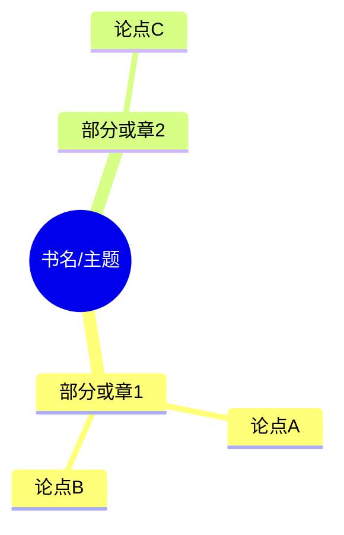

# 读书笔记结构化整理

将书籍文本、摘抄或截图整理为**分层结构化笔记**：全书框架 → 分章论点 → 关键案例 → 可摘抄金句。输出适合读书报告、课堂作业、论文引用。

## 何时启用

- 用户上传 / 粘贴书籍正文、章节摘抄、读书截图
- 用户要求：读书笔记、分章梳理、人物关系、故事脉络、金句、考点、思维导图式框架
- 匹配下方提示词模板任一意图

## 提示词模板（示例）

**示例 1：** 上传这本社会学书籍摘抄，分章节梳理核心观点，整理可用于论文引用的金句。

**示例 2：** 整理这本文学小说读书笔记，梳理人物关系、故事脉络、中心主旨，做成简洁框架。

**示例 3：** 专业教材读书笔记，提取每章核心理论、关键案例，标注考试可背诵考点。

## 工作流

### 1. 识别输入与体裁

| 输入 | 处理 |
|------|------|
| 粘贴文本 / 摘抄 | 直接分析；缺章节信息时按语义分段 |
| 书籍截图 / 图片 | 先读图提取文字，再整理；模糊处标注「原文不清」 |
| 多文件 / 多章 | 先列目录大纲，再逐章输出 |

判定体裁（决定模板侧重）：

| 体裁 | 侧重模块 |
|------|----------|
| 社科 / 非虚构论著 | 核心框架、分章论点、金句（可引用） |
| 文学 / 小说 | 人物关系、故事脉络、中心主旨 |
| 专业教材 | 核心理论、关键案例、考试考点 |
| 混合 / 未说明 | 先问一句用途；若用户要直接出结果，用「通用完整版」 |

信息不足时，用简短确认（可一次问清）：书名/作者（若可知）、体裁、用途（报告 / 论文引用 / 考试）、是否只要某几章。

### 2. 抽取原则

- **忠于原文**：论点、金句尽量贴近原文表述；推断处标明「归纳」
- **可溯源**：有页码/章节则标注；无则写「据所给摘抄」
- **分层清晰**：全书一层 → 章一层 → 要点一层；避免大段复述
- **金句可摘抄**：独立成条，短句优先；论文场景附简短适用说明
- **考点可背**：教材场景用「定义 / 对比 / 步骤 / 易混点」短条，便于记忆

### 3. 按体裁选择输出模板

详细空模板见 [references/templates.md](references/templates.md)。默认结构如下。

#### A. 通用完整版（默认）

```markdown
# 《书名》结构化读书笔记

> 来源：粘贴文本 / 截图OCR / 摘抄 | 整理用途：…

## 一、全书整体框架（思维导图式）
- 中心主题：
- 结构脉络：（章/部 → 逻辑关系，可用缩进树或 mermaid）
- 作者核心立场 / 主旨（1–3 句）：

## 二、分章节核心论点
### 第 X 章 / 部 · 标题
- 本章命题：
- 核心论点：
  1. …
  2. …
- 关键概念 / 术语：
- 关键案例 / 论据：
- 与前后章关系：

## 三、人物关系（文学类填写；否则可省略）
- 人物表 + 关系说明
- （可选）mermaid 关系图

## 四、故事脉络 / 论证脉络
- 起 → 承 → 转 → 合（或：问题 → 分析 → 结论）

## 五、金句摘抄
| 序号 | 金句 | 出处（章/页） | 可用场景 |
|------|------|---------------|----------|
| 1 | 「…」 | | 论文/报告/… |

## 六、关键案例速查
- 案例名：要点 → 支撑的论点

## 七、考试 / 作业可用要点（按需）
- 可背考点：
- 易混对比：
```

#### B. 社科 / 论文引用侧重

强化：分章核心观点、概念界定、论证链条、**可引用金句表**（含适用论点提示）。弱化人物关系。

#### C. 文学小说侧重

强化：人物关系图、故事脉络、中心主旨、象征/主题母题。金句偏主题与人物刻画。框架保持简洁。

#### D. 专业教材 / 考点侧重

每章固定四块：**核心理论** → **关键案例** → **可背诵考点** → **易错/对比**。金句改为「标准表述 / 定义句」。

### 4. 思维导图呈现

全书框架优先用**缩进树**；关系复杂时用 mermaid：



人物关系可用：


### 5. 交付检查

- [ ] 有全书一层框架，而非只有散点摘录
- [ ] 分章结构与输入章节对应（或已说明按语义重分段）
- [ ] 金句可直接复制；论文场景有出处/适用说明
- [ ] 教材场景考点短、可背；文学场景人物与脉络清楚
- [ ] 未把推测写成原文；截图不清处已标注

## 边界

- 不编造未出现的情节、数据、页码、作者观点
- 不替代用户完成需原创的整篇读书报告正文（本技能产出**结构化笔记骨架与摘录**；若用户要求扩写成完整报告，再在笔记基础上扩写并标明哪些是原文金句）
- 版权：仅基于用户提供的文本/摘抄整理，不主动拉取整书盗版资源
