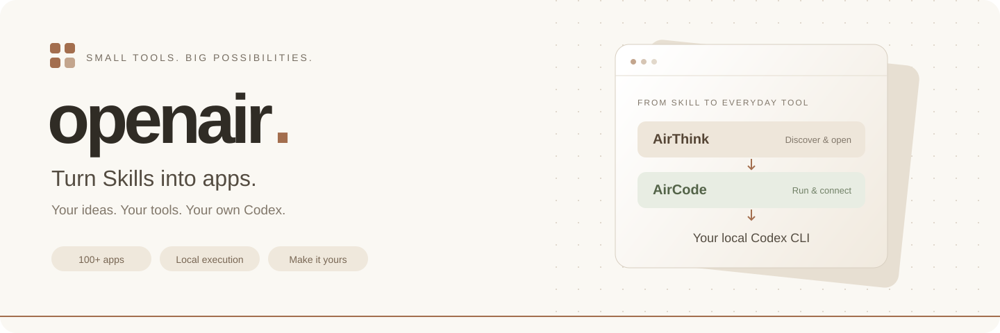
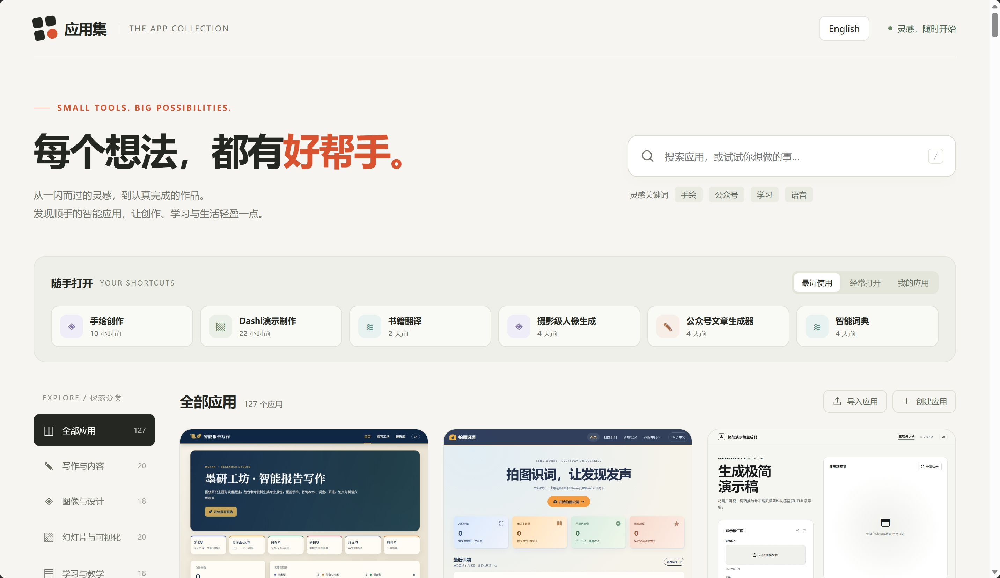

<p align="center">
  
</p>

<p align="center">
  <a href="README.md"></a>
  <a href="README.en.md"></a>
</p>

# openair

**把 Skill 做成应用，让 AI 能力更容易使用和管理。**

通常，我们在 Codex 中通过对话使用 Skill。openair 希望将这些能力变成可以直接打开的应用：用户在浏览器中选择工具、输入内容、获取结果，并在自己的应用集中管理和扩展它们。

openair 由 **AirCode** 和 **AirThink** 两个本地服务组成。AirCode 让应用通过本机 Codex 使用 AI；AirThink 提供应用集页面，收集了上百个应用，也支持导入自己开发的应用。



## 为什么做 openair

- **让 Skill 有应用界面**：把任务流程做成可操作的页面，方便日常使用。
- **使用自己的 Codex**：应用通过 AirCode 调用本机 Codex CLI，使用用户自己的登录环境。
- **利用订阅服务**：希望借助 Codex 订阅降低日常使用成本，减少按量调用模型 API 的开销；实际成本与可用额度取决于用户的订阅和使用情况。
- **集中发现和管理应用**：在同一个页面搜索应用、按分类浏览，并访问自己的应用。
- **按需定制**：在 [ithinkair](https://www.ithinkair.com) 开发应用，导出源码后导入本地应用集。

## 工作原理

```text
浏览器中的应用
      │
      ▼
AirThink（3130）
应用页面、文件和应用管理
      │
      ▼
AirCode（3131）
任务与工作流执行
      │
      ▼
本机 Codex CLI
      │
      ▼
AI 处理任务，结果返回应用
```

AirCode 通过 `codex exec` 执行 AI 任务。因此，运行应用前，需要让启动服务的 Windows 用户能够在命令行中正常使用 Codex。

## 快速开始

### 1. 准备环境

当前启动脚本面向 **Windows**。请准备：

- Python 3，且 `python`、`pip` 可以正常使用。
- 已安装、登录并可正常执行任务的 Codex CLI，且 `codex` 已加入 `PATH`。
- 现代浏览器，以及安装依赖和访问 AI 服务所需的网络连接。

在 PowerShell 中检查环境，并预先安装服务启动需要的 `waitress`：

```powershell
python --version
python -m pip --version
codex --version
python -m pip install waitress
```

两个服务会在启动时检查并通过 pip 安装缺失的 Python 依赖。首次启动可能需要较长时间，请留意服务窗口中的输出。部分应用还可能需要额外的工具或运行环境。

### 2. 启动服务

进入 `openair` 目录后运行：

```powershell
cd openair
.\start.bat
```

也可以在资源管理器中打开 `openair` 文件夹，双击 `start.bat`。

脚本会启动 AirThink 和 AirCode，在检测到 `3130` 端口开始监听后，自动打开：

**[http://127.0.0.1:3130/index.html](http://127.0.0.1:3130/index.html)**

使用期间请保留两个服务窗口。页面打开时，AirCode 可能仍在安装依赖，请等它完成启动后再执行 AI 任务。结束使用时，关闭两个服务窗口即可停止服务。

> 启动脚本会先强制结束占用 `3130`、`3131` 端口的进程，请确认这两个端口没有用于其他需要保留的服务。

### 3. 打开应用

在应用集页面搜索关键词，或按分类浏览应用，点击应用卡片即可打开。

首次打开时，页面会要求输入 **用户密钥（User Key）**。这是 AirThink 的本地访问密钥，与 Codex 登录凭据、模型 API Key 无关：

- 密钥保存在 `AirThink/apps/userkey.json` 中，格式为 JSON 字符串数组。使用前可将其设置为自己的密钥，例如 `["your-own-local-key"]`。
- 如果该文件不存在，首次提交的非空密钥会被保存为本地密钥。
- 验证成功后，浏览器会保存密钥，方便后续打开应用。

## 内置应用

应用集收集了上百个应用，涵盖以下分类：

| 分类 | 使用方向 |
| --- | --- |
| 写作与内容 | 内容创作、文章与文案 |
| 图像与设计 | 图像处理、视觉设计 |
| 幻灯片与可视化 | 演示文稿、图表与信息展示 |
| 学习与教学 | 学习辅助、教学工具 |
| 研究与效率 | 资料处理、研究与办公 |
| 语音与语言 | 语音、语言学习与转换 |
| 生活与成长 | 日常工具、个人成长 |
| 传统文化 | 传统文化相关应用 |

这些应用可以从本地应用集直接打开，AI 任务由自己的 Codex 执行。

## 创建和导入自己的应用

1. 访问 [https://www.ithinkair.com](https://www.ithinkair.com)，也可以点击应用集中的「创建应用」。
2. 根据自己的需求开发应用，完成后导出应用源码 ZIP 包。
3. 返回本地应用集，点击「导入应用」，选择导出的 `.zip` 文件。
4. 导入完成后，在「我的应用」中打开使用。

请保留导出包原有的目录结构。导入器读取 ZIP 中的 `AirThink/apps/`、`AirThink/files/` 和 `AirThink/skills/`，将应用及相关资源导入本地，并更新应用列表。导入时，同路径的已有文件会被覆盖。

## 项目结构

```text
openair/
├── start.bat              # 启动两个服务并打开浏览器
├── AirCode/
│   ├── app.py             # 任务服务入口
│   ├── startweb.py         # HTTP 服务启动入口（3131）
│   ├── run.bat
│   ├── worker/            # 工作流、AI 调用与任务执行
│   ├── utilities/         # 文件处理和通信等工具
│   └── SERVERFILES/       # 任务文件与 Codex 工作目录
└── AirThink/
    ├── app.py             # 应用、文件、导入和通信服务
    ├── startweb.py         # HTTP 服务启动入口（3130）
    ├── run.bat
    ├── apps/              # 应用集页面、应用源码和本地配置
    ├── files/             # 应用资源及上传文件
    └── skills/            # Skill 文件和资源
```

AirThink 还使用 `3133` 端口提供 WebSocket 服务。

## 常见问题

**浏览器没有自动打开，或者页面无法访问？**

检查 AirThink 窗口中的输出，确认依赖安装完成、服务成功启动。随后手动访问 [应用集页面](http://127.0.0.1:3130/index.html)。从命令行启动时，务必先进入 `openair` 目录，因为启动脚本使用相对路径。

**页面能打开，但 AI 任务没有结果？**

检查 AirCode 窗口中的输出，确认服务已启动，并确认同一个 Windows 用户可以在终端中正常运行 Codex 任务。仅能执行 `codex --version` 并不代表已经完成登录或具备可用额度。

**导入应用失败？**

请选择 ithinkair 导出的源码 ZIP 包，并保留包内的 `AirThink/apps/` 等目录结构。可在 AirThink 窗口查看具体错误。

## 运行说明

当前服务监听 `0.0.0.0`；AirCode 执行 Codex 任务时使用 `danger-full-access`，并关闭逐次审批。请在可信的个人环境中运行和导入应用，不要直接将服务暴露到公网。

## 参与贡献

欢迎提交问题反馈、改进建议和代码贡献。反馈问题时，请附上复现步骤、相关服务的报错信息，以及 Python 和 Codex CLI 版本；分享日志前请移除密钥和个人数据。
